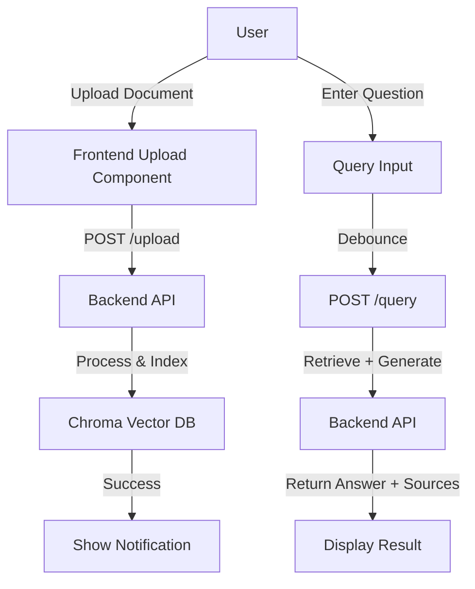

## 1. Product Overview
RAG Document QA System - A modern web interface for uploading documents, managing knowledge base, and querying AI-powered answers with source references.

- **Main Purpose**: Provide users with an intuitive interface to upload documents and get intelligent answers based on the knowledge base
- **Target Users**: Researchers, developers, content creators who need to query information from uploaded documents
- **Market Value**: Simplify document-based Q&A workflow with AI-powered retrieval and generation

## 2. Core Features

### 2.1 User Roles
| Role | Registration Method | Core Permissions |
|------|---------------------|------------------|
| User | No registration required | Upload documents, query knowledge base, view answers |

### 2.2 Feature Module
1. **Home/Query Page**: Main chat interface, document upload, question input, answer display with sources
2. **Document Management**: Upload history, document statistics, knowledge base status

### 2.3 Page Details
| Page Name | Module Name | Feature description |
|-----------|-------------|---------------------|
| Home Page | Header | System title, health status indicator |
| Home Page | Document Upload | Drag-and-drop file upload, supported formats (PDF/MD/TXT), upload progress |
| Home Page | Query Interface | Question input with debounce, submit button, language selector |
| Home Page | Answer Display | AI-generated answer, source references with file name and page number |
| Home Page | Knowledge Base Stats | Total documents, total chunks, health status |

## 3. Core Process

**Document Upload Flow**:
1. User selects or drags a document file
2. System validates file type
3. Upload starts with progress indicator
4. Backend processes and indexes the document
5. Success/error notification displayed

**Query Flow**:
1. User enters a question
2. System sends query to backend
3. Backend retrieves relevant chunks and generates answer
4. Answer and sources are displayed

## 4. User Interface Design

### 4.1 Design Style
- **Primary Color**: Deep blue (#1e3a8a) - trust and intelligence
- **Secondary Color**: Teal (#0d9488) - accent for interactive elements
- **Button Style**: Rounded corners (12px), gradient hover effects
- **Font**: Inter for body, Playfair Display for headings (elegant contrast)
- **Layout**: Card-based with clean white space, centered content
- **Icon Style**: Lucide icons - modern, minimalist

### 4.2 Page Design Overview
| Page Name | Module Name | UI Elements |
|-----------|-------------|-------------|
| Home Page | Header | Dark gradient background, white title text, health status badge |
| Home Page | Upload Zone | Dashed border, upload icon, drop hint text, browse button |
| Home Page | Query Section | Card with question input field, language dropdown, submit button |
| Home Page | Answer Section | Card with answer content, collapsible sources list |
| Home Page | Stats Panel | Three stat cards showing document count, chunk count, health |

### 4.3 Responsiveness
- Desktop-first approach
- Mobile adaptive: stacked layout on small screens
- Touch optimization for buttons and interactive elements
- Max-width container with centered content

### 4.4 Visual Effects
- Smooth transitions for hover states
- Loading spinner with pulse animation
- Success/error notifications with slide-in animation
- Gradient backgrounds for hero sections
