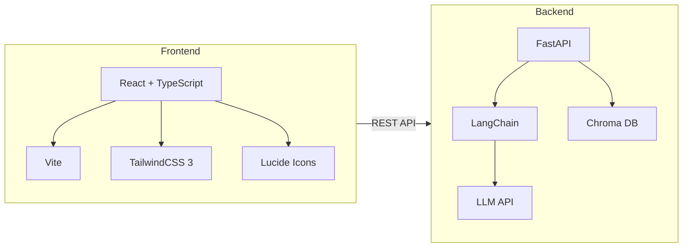
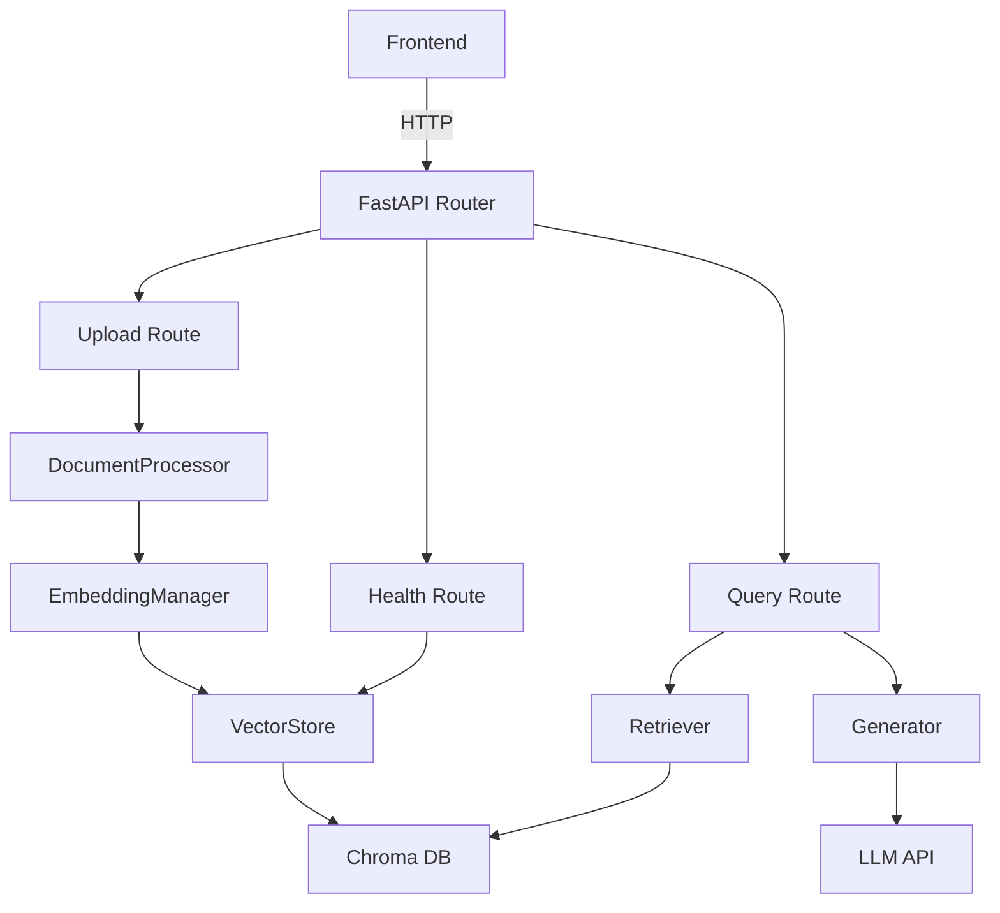

## 1. Architecture Design



## 2. Technology Description

* **Frontend**: React\@18 + TypeScript + TailwindCSS\@3 + Vite

* **Initialization Tool**: vite-init (react-ts template)

* **Backend**: FastAPI (existing)

* **API Integration**: Axios for HTTP requests

* **Icons**: Lucide React

* **State Management**: React useState/useEffect (simple app)

* **Debounce**: Lodash debounce

## 3. Route Definitions

| Route | Purpose                                          |
| ----- | ------------------------------------------------ |
| /     | Home page with upload, query, and answer display |

## 4. API Definitions

### 4.1 Health Check

**GET /health**

* Response:

```typescript
interface HealthResponse {
    status: string;
    document_count: number;
}
```

### 4.2 Upload Document

**POST /upload**

* Request: multipart/form-data

* Parameters:

  * file: File (PDF/MD/TXT)

* Response:

```typescript
interface UploadResponse {
    message: string;
    file_name: string;
    chunks_count: number;
}
```

### 4.3 Query Knowledge Base

**POST /query**

* Request Body:

```typescript
interface QueryRequest {
    question: string;
    language: string; // "zh" | "en"
}
```

* Response:

```typescript
interface Source {
    source: string;
    page: number;
    content: string;
    score: number;
}

interface QueryResponse {
    answer: string;
    sources: Source[];
}
```

## 5. Server Architecture Diagram



## 6. Frontend Project Structure

```
frontend/
├── src/
│   ├── components/
│   │   ├── Header.tsx          # Page header with title and status
│   │   ├── UploadZone.tsx      # Document upload component
│   │   ├── QuerySection.tsx    # Question input and submit
│   │   ├── AnswerDisplay.tsx   # AI answer and sources
│   │   ├── StatsPanel.tsx      # Knowledge base statistics
│   │   └── Notification.tsx    # Toast notifications
│   ├── utils/
│   │   ├── api.ts              # API client with axios
│   │   └── debounce.ts         # Debounce utility
│   ├── types/
│   │   └── index.ts            # TypeScript types
│   ├── App.tsx                 # Main app component
│   ├── main.tsx               # Entry point
│   └── index.css              # Global styles
├── index.html
├── package.json
├── vite.config.ts
├── tailwind.config.js
├── postcss.config.js
└── tsconfig.json
```

## 7. Environment Configuration

```env
VITE_API_BASE_URL=http://localhost:8000
```

